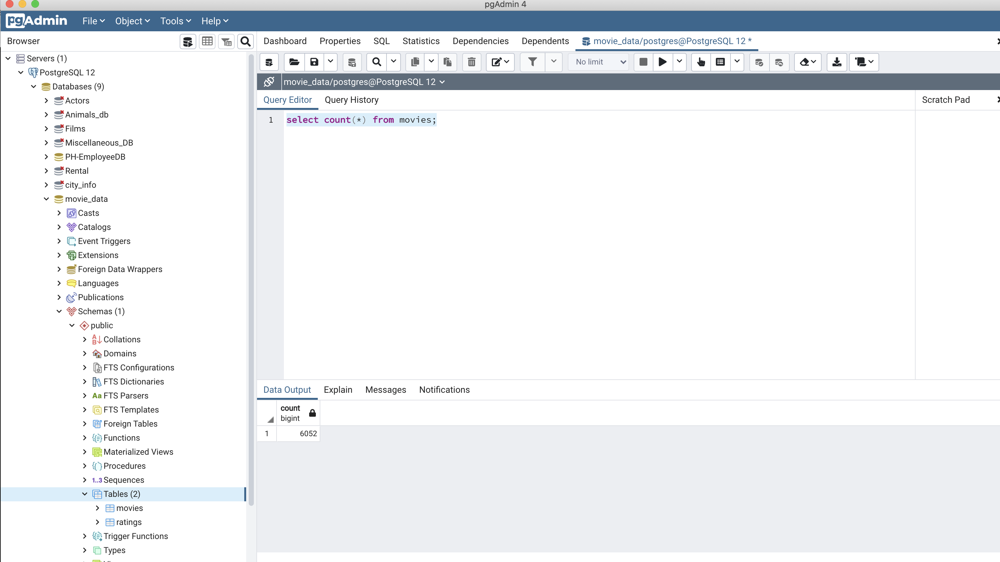
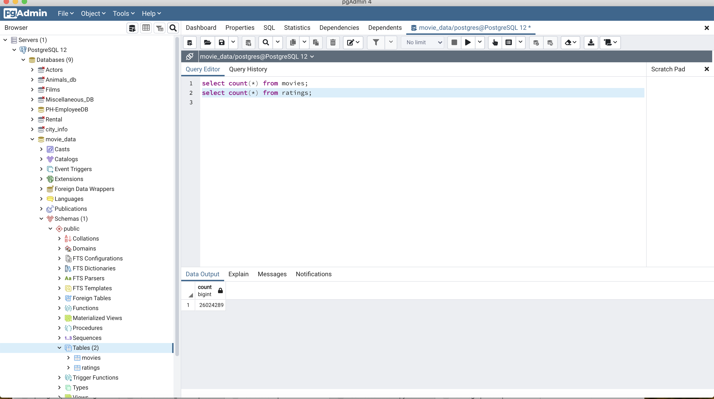

# Overview

If the Jupyter notebooks are not rendered correctly, use an online viewer such as https://kokes.github.io/nbviewer.js/viewer.html

In this exercise, the three stages of data analysis are explored:

* **Extract**: For this exercise, data is retrieved from the following three sources:
  * Wikipedia movie information: Information of more than 7000 movies is extracted.
  * Kaggle metadata: This contains additional information (metadata) about the movies in the Kaggle service.
  * Ratings metadata: More than 26 million ratings for the movies above are extracted from the Kaggle service.

* **Transform**: In this exercise, data was transformed using a variety of techniques such as applying regexes to normalize values pertaining to a column.

* **Load**: Finally, the data was loaded to a Postgres database.

# Results:

All results are uploaded for this exercise. The code is available in the Jupyter notebooks. The successul loading of the data in the database can be seen from the counts of movies and ratings tables as shown below.

